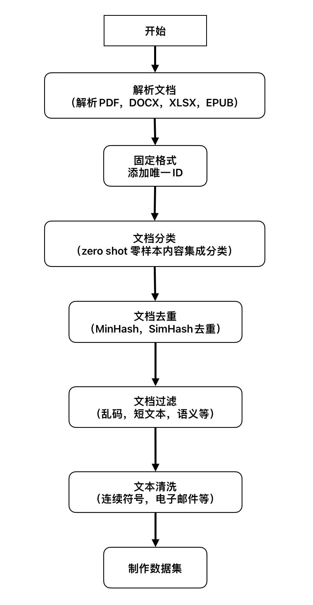

# Lumix

这是一个准备大语言模型数据的开源项目，由于大家都在卷模型的预训练与指令微调，大部分公开的项目也很少提及处理清洗数据的细节。

我希望这个项目能够帮助到大家，尽可能完成数据的清洗工作，让大家能够更加专注于模型的训练与微调！

## 项目结构

* [解析文档](docs\zh\README_Store_zh.md "数据存储格式")
* [固定格式](docs\zh\README_Store_zh.md "固定格式")
* [添加唯一ID](docs\zh\README_Store_zh.md "反向确认")
* [文档分类](docs\zh\README_CLASS_zh.md)
* [文档去重](docs\zh\README_DP_zh.md)
* [文档过滤](docs\zh\README_Filter_zh.md)
* [文本聚类](docs\zh\README_CLUSTER_zh.md)
* [文本清洗](docs\zh\README_CLEAN_zh.md)

---

## 处理流程



通过最先解析文档，处理不同的来源的文档，如word，pdf等，通过对应的算法解析出每篇文档中对应的内容，固定不同来源不同语言不同内容的文档，添加唯一ID，同时固定标准的存储格式。之后，我们对这些数据进行内容端的分类，添加对应的类别字段。再进行去除重复，Minhash与Simhash都可以进行去重，保存去重后的Minhash索引与文档ID，方便后续新增数据去重。之后根据去重后的ID，取对应的文本数据，利用过滤模型，过滤掉存在乱码的，过短的以及语义不通的文档，在去重ID的基础上再精简ID进行存储；最后，我们利用保留的ID，获取对应的文本，对具体的文本进行一定的清洗工作，制作对应的数据集。

## 使用方式

配置相关环境提供了两种方案：
第一，根据yml配置文件安装环境

```
conda env create -f environment.yml
conda activate <env_name>
```

第二，提供conda pack安装包供在云端下载，直接激活

```
tar -xvf fast.tar
source fast/bin/activate
```

该环境在 `CUDA Version: 11.6`以上的liunx环境中能够正常运行，如果使用windows环境有可能会存在有些包不支持的情况。

---


## 数据存储

所有的数据都会存储在 `Data`目录下，`Data`下存储结构如下：

* `origin`：存储最原始的解析后的文本数据
* `unique`：存储固定格式与增添 `ID`后的文本，按文本来源进行分类存储
* `classify`：存储分类后的文本数据，与 `unique`文件夹的结构与存储数据基本一致，只增加类别标签
* `ids`：存储文档数据的的 `ID`列表，其中分为 `deduplicated `与 `filtered `两个文件夹，`deduplicated `文件夹中存储去重后的 `ID`列表与重复的 `ID`列表，`filtered `文件夹中存储的则是在去重基础上再进行文档过滤后的 `ID`列表
* `hash_index`：存储 `minhash`的索引表，分为通用与领域两个文件夹进行存储。
* `clean`：存储走完整个清洗流程后供使用的数据
* `unique_ids.json`：该文件是存储已经存在的 `ID`列表，防止新数据添加 `ID`时重复
* `filename_to_ids.json`：存储每个文本文件中的 `ID`列表

---


## 简单使用

为了方便大家定制自己的数据工程，我们将解析文档单独分开处理，你可以选择自定义自己已有文档的解析方案，也可以使用我们所提供的[方案](docs\zh\README_Parser_zh.md)。但是不管自定义还是使用我们的方案，最后请使用字典来储存文档，其中文本存储在字典的 `text`字段，从而后续处理不需要修改代码。

`example`：
